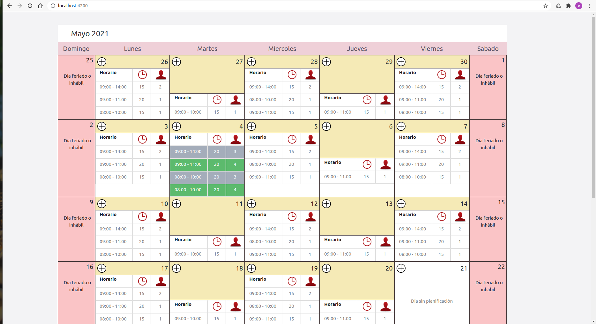
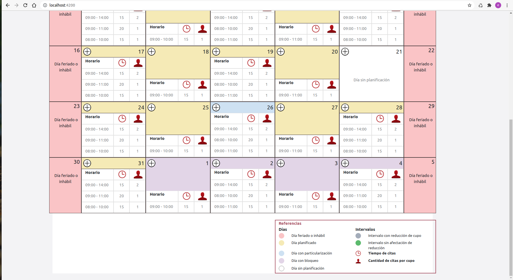

# Calendar

This project was generated with [Angular CLI](https://github.com/angular/angular-cli) version 10.0.4.

## Requerimientos

#### Bootstrap 5 
###### Si no se tiene instalado bootstrap, entonces ejecutar:

`npm install bootstrap --save`

** Tambien importar bootstrap, agregar:

    @import 'bootstrap/dist/css/bootstrap.css'; 
** en el archivo:

    styles.scss

## Uso

#### -Copiar la carpeta `calendar-schedule` de la ruta `/calendar/src/app/calendar-schedule` a tu proyecto.

#### -Importa el modulo `CalendarScheduleModule` en `AppModule` o en el modulo donde lo utilices
#### -Usar el componente: `<app-calendar-schedule></app-calendar-schedule>`

# Preview

Pantalla 1: 

Pantalla 2: 
